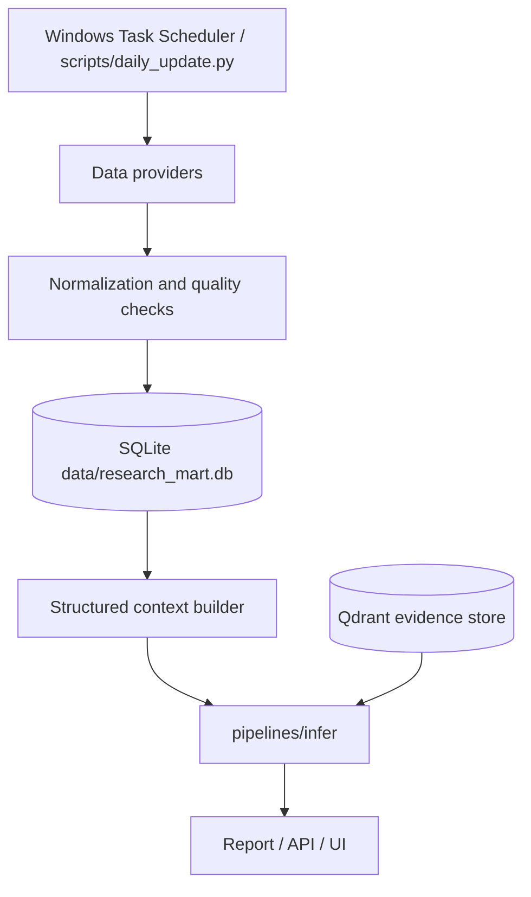

# Architecture

## End-to-End Flow

The Research Assistant follows a sequential architectural flow modeled globally inside `pipelines/orchestration/research_pipeline.py`:

```mermaid
graph TD
    A[CLI Request] --> B[AnalysisRequest]
    B --> C[pipelines/collect]
    C --> D[Yahoo / FRED / SEC / Google RSS / optional Alpha-OpenBB-FMP]
    D --> E[Raw Documents]
    E --> F[pipelines/ingest]
    F --> G[(Qdrant Vector DB)]
    G --> H[pipelines/retrieve]
    H --> I[pipelines/infer]
    I --> J[Ollama / qwen2.5:7b primary]
    J --> K[Raw Output Dict]
    K --> L[pipelines/analyze]
    L --> M[AnalysisResponse]
    M --> N[Report Generator]
    N --> O[Outputs (JSON/Markdown/HTML)]
```

The scheduled data path is additive to the request-time RAG path:



Qdrant remains a document evidence store. Structured market data belongs in the data mart:

- `data/research_mart.db`: assets, daily OHLCV, macro series/observations, article metadata, filings, update runs, provider status, quality checks.
- `data/runs.db`: research execution history and output lookup only.
- Qdrant: news, filings, transcripts, report chunks, and current-run evidence retrieval.

## Data Movement
1. AnalysisRequest initializes the process.
2. `collect` fetches bounded source-specific records, records per-source status, and saves a snapshot into `data/raw`.
3. `ingest` processes, normalizes, chunks, and creates vectors inside Qdrant.
4. `retrieve` translates the query and isolates exactly `top_k` documents to fit context windows.
5. The structured context builder loads authoritative numeric price/macro/freshness data from `data/research_mart.db` when available.
6. The model adapter accepts the `documents` array, structured context, and the string query, then outputs JSON.
7. The analyze layer builds summaries.
8. Save routines dump it to `data/outputs`.

## Structured Data Mart Boundary

`pipelines/data_mart` owns structured storage and scheduled updates:

- `storage/schema.py`: idempotent SQLite DDL and schema version.
- `storage/db.py`: SQLite connection setup, WAL mode, migration table, `init_db()`.
- `storage/repository.py`: upsert/query APIs for prices, macro observations, news metadata, SEC filing metadata, run logs, provider status, and quality checks.
- `providers/*`: external provider adapters such as yfinance and FRED.
- `jobs/*`: daily update orchestration for prices, macro, news, SEC filings, and data quality checks.
- `context/structured_context.py`: converts stored data into LLM-safe numeric context with source, `as_of`, and freshness metadata.

LLM numeric policy:

- Structured context is authoritative for numeric values.
- RAG documents are qualitative/citation evidence.
- If a required structured value is missing or stale, the report must surface partial/unknown state instead of inventing a metric.

## Macro Dashboard Workbench

The static `/ui/#macro` tab is a read-only decision workbench over the Macro service boundary:

- `app/web/app.js` loads `/api/v1/macro/dashboard` first, then hydrates provider health, category panels, portfolio hints, and action panes independently so one failed panel does not erase the rest of the dashboard.
- `pipelines/macro/dashboard.py` aggregates registry coverage, latest observations, heatmap/summary data, quality state, and advisory metadata without mutating provider state.
- `pipelines/macro/provider_health.py` exposes configured/unconfigured provider status, latest rows, stale series, scheduler state, and explicit warnings.
- `pipelines/macro/scenario.py` provides deterministic shock analysis for rates, inflation, growth, credit, and oil inputs. Its API is advisory-only and returns asset impacts plus sleeve hints; it does not place orders, rebalance, or mutate AI Portfolio policy.
- `scripts/macro_ui_smoke.py` is the browser acceptance probe for the static Macro tab and can start a disposable local FastAPI server when no base URL is provided.

## Enterprise-Macro Risk Workbench

The static `/ui/#risk` tab is a deterministic risk control plane over existing Quantamental and Macro service boundaries:

- `app/api/routers/risk.py` exposes `/api/v1/risk/*` routes for health, company, macro, scenario, and workbench responses.
- `pipelines/risk/` owns aggregation, company adapters, macro adapters, data-quality policy, transmission channels, and scenario matrix construction.
- `core/schemas/risk.py` centralizes typed request and response contracts so the UI renders a stable API shape.
- Risk scores use `higher_is_riskier` direction. Source scores with safer-is-higher direction, including Quantamental company risk scores and data-quality scores, are inverted at the adapter boundary and annotated in the calculation policy.
- ETF and macro proxy symbols such as `TLT`, `HYG`, and `SPY` are handled as limited asset-proxy subjects when price and macro evidence exist. Missing company fundamentals and SEC evidence stay visible, but they no longer masquerade as invalid tickers or force loss of rates/credit/liquidity transmission analysis.
- `input_receipt` records the normalized mode, subjects, position weights, compatibility notes, and replay notes for every run. This makes the first UI pass and any saved service output explicit about what was actually analyzed.
- `priority_map` ranks the most important company, macro, and data-quality cells for the first decision pass. `run_lineage` records service version, replay fields, adapter status, evidence counts, freshness counts, and input scope for saved-run comparison and future service wrapping.
- `confidence_factors` explains the confidence score in typed rows for company coverage, macro backdrop, data quality, scenario coverage, and service controls. This keeps the top-line confidence value auditable instead of making users infer deductions from multiple panels.
- `handoff_queue` converts each Risk run into explicit next workflows such as Risk evidence repair, Macro pressure review, Quantamental drilldown, ML Forecast validation test, AI Portfolio overlay review, and service-wrapper release checks. These handoffs are navigation and validation guidance only; they do not change score math or create trade-action instructions.
- `ml_validation_tests` converts a Risk run into concrete ML Forecast validation experiments: walk-forward baseline, macro-feature leakage check, severe-scenario forecast backtest, asset-proxy validation, portfolio component OOS check, or blocked data-gate recheck. Actionable tests include typed `forecast_prefill` settings and a `launch_href` so the UI can open `/ui/#ml-forecast` with ticker, benchmark, horizon, validation method, target type, and macro/cross-asset switches already populated. Blocked data-gate tests do not expose a Forecast launch link. These tests are experiment setup guidance only and keep forecast validation separate from Risk scoring.
- `forecast_validation_plan` summarizes the ML Forecast validation workflow into one selected primary test, ordered run list, experiment controls, acceptance criteria, and blocked reasons. It is derived from `ml_validation_tests`, data-quality state, and Risk provenance so users know what to run first and how to judge the result without changing Forecast math.
- `decision_path` consolidates the top action, linked workflow, Forecast validation launch, service gate, and evidence refs into one first-flow summary. It is derived from existing checklist, handoff, ML validation, readiness, and priority-map contracts so the UI can reduce duplicate scanning without inventing new conclusions.
- `decision_quality` compresses confidence, data-quality gates, normalized input receipt, service readiness, release packet, checklist state, and ML Forecast validation availability into one first-flow quality score and status. It is a usability summary for whether the run is ready, review-bound, or blocked; it does not change the underlying Risk score.
- `decision_compass` turns the Risk run into a compact user workflow: verify input and decision quality, review evidence coverage, run linked ML Forecast validation when available, control AI narrative output, and review the service gate. It is a UI/navigation aid built from deterministic fields, not a new scoring layer.
- `evidence_coverage` summarizes input, company, macro, scenario, Forecast-validation, service-release, and evidence-inventory coverage in typed `ok`, `review`, or `blocked` rows. It lets the first-flow UI and evidence drawer show which domains are usable, review-bound, or blocked without duplicating Risk score math.
- `compatibility_matrix` summarizes each requested subject's supported and blocked downstream workflows across Risk, Quantamental, Macro, ML Forecast, AI Portfolio, and service exposure. It is a routing and product-safety gate only; it does not change Risk scores or Forecast math.
- `ai_output_controls` gives any model-written Risk narrative a typed grounding packet: status, language, required evidence refs, allowed claims, blocked claims, citation policy, review instructions, and prompt context. This keeps AI output tied to deterministic Risk contracts and prevents missing metrics, service readiness, or ML Forecast experiments from being overstated.
- Risk-to-Forecast launches carry `riskValidation`, `riskInputHash`, `riskTestType`, `riskTestPriority`, and `riskTestLabel` query parameters into the ML Forecast tab. The frontend maps them into `ForecastRunRequest.source_context`, so queued or trained forecast experiments can preserve Risk provenance without changing forecast math.
- Invalid tickers, missing price history, missing quant payloads, and macro-regime failure still fail closed through the Risk data-quality policy.
- The response includes a deterministic `decision_brief` that summarizes review questions, watch items, blocked reasons, and deployment notes without issuing buy/sell/hold instructions.
- The response includes `action_checklist`, a typed decision-support checklist that marks data-quality, top-driver, scenario, asset-proxy, portfolio concentration, and release-gate actions as `ok`, `review`, or `blocked` with evidence refs and next steps.
- The response includes `monitoring_triggers`, typed post-run watchpoints for data-quality gates, dominant drivers, macro transmission channels, severe scenarios, asset-proxy scope, and service release readiness. These triggers help users monitor what could change the conclusion without changing the scoring policy.
- The response also includes `service_readiness`, a structured deployment gate with `ready`, `review_required`, or `blocked` status, checklist evidence, blockers, warnings, and next steps. This keeps service-readiness separate from investment-risk scoring and lets UI/API consumers treat `decision_usable=false` as a stop state.
- The response also includes `release_packet`, an operator-facing deployability contract with API/UI routes, required audit fields, validation commands, deployment checks, rollback triggers, data dependencies, and limitations. It stays separate from investment-risk scoring and deliberately keeps public deployment in `review_required` until platform auth, rate limiting, retention, and monitoring are supplied outside the Risk response.
- The workbench does not generate buy/sell/hold recommendations. It exposes decision usability, confidence, freshness, evidence, and calculation policy so missing or stale inputs remain visible.

## Quant Analytics Boundary

The deterministic quant layer is split by responsibility:

- `pipelines/factors`: returns, momentum, volatility, drawdown, correlation, rate sensitivity.
- `pipelines/backtest`: strategy execution, cost/slippage assumptions, no-lookahead signal application, single-asset metrics, and aligned multi-asset portfolio equity curves.
- `pipelines/portfolio`: equal weight, inverse volatility, covariance-aware risk parity, minimum-volatility, max-Sharpe, and momentum-tilt optimizers with expected return/volatility/Sharpe and risk-contribution diagnostics.
- `pipelines/analyze/portfolio_quant.py`: existing deterministic API baseline retained for `/api/v1/research/portfolio/risk`.

## Provider Boundary

- The default data path is key-light: Yahoo/yfinance for market/news, FRED for macro when configured, SEC EDGAR for official filings, and Google News RSS for keyless article coverage.
- Alpha Vantage news is a key-backed fallback that runs before OpenBB/FMP when `ALPHA_VANTAGE_ENABLED=true`.
- OpenBB is installed and checked by `scripts/check_openbb_compat.py`, but OpenBB news is opt-in (`OPENBB_NEWS_ENABLED=true`) because provider package combinations can fail at runtime even when dependency metadata is valid.
- FMP is auxiliary only. FMP stock news and transcripts are called only when `FMP_ENABLED=true` and the relevant credentials are present.
- The validation gate includes provider compatibility separately from runtime preflight so package breakage, provider entitlement, and network reachability are not conflated.

## Output Traceability Contract

- Every numeric or value-bearing item surfaced through `key_metrics` must carry `as_of`.
- Preferred `as_of` source is the supporting evidence block date (`RetrievalItem.date`) matched by `evidence_doc_ids`.
- If the model omits `as_of`, orchestration backfills it from the cited document date before building `AnalysisResponse` or `TopicResponse`.
- If no date can be resolved, the field is set to `unknown` and reports/UI render that as an explicit unknown 기준일 instead of silently omitting freshness.
- Reports and the UI must display this basis date next to the metric value so users can distinguish current values from stale evidence.
- Claim-level evidence is also audited: bull/bear points and topic drivers, risks, scenarios, and execution strategies carry `evidence_doc_ids`; report/UI rendering resolves those ids back to document dates and sources.

## Topic Quant Snapshot

- Topic mode adds a deterministic quant layer before LLM inference in `pipelines/analyze/topic_quant.py`.
- For `rates_bonds` and `TLT`, the layer derives Treasury yield levels, 10Y-2Y curve, real-yield proxy, TLT price trend when available, duration proxy, and rate-shock sensitivity.
- The same canonical layer now emits proxy quant snapshots for credit, FX, commodity, crypto, and sector/theme questions. Each metric carries value, unit, `as_of`, source, evidence ids, and freshness status.
- The snapshot is injected into the topic prompt as authoritative evidence, merged into `key_metrics`, and stored at `execution_meta.extras.quant_snapshot`.
- Quant-backed buckets can substitute for missing market-structure evidence. For TLT, missing latest catalyst/news is warning-only when macro plus market-structure or quant substitute exists.
- Quality gates record `metric_as_of_coverage`, `claim_evidence_date_coverage`, bucket coverage, substituted buckets, and actionable partial reasons.

## Universal Routing Guard

- `pipelines/router/query_router.py` treats the written question as authoritative when a stale optional ticker hint conflicts with a recognizable topic.
- If a user leaves `GLD`, `TLT`, `BTC-USD`, or another proxy in the ticker box but asks a credit, rates, commodity, FX, crypto, sector, or Korea inverse ETF question, auto mode routes to the topic proxies inferred from the question.
- Explicit tickers inside the question still win. For example, a question that names `GLD` remains commodity-oriented, while a credit-risk question with stale `GLD` routes to `HYG`, `LQD`, and `TLT`.
- The static UI mirrors this guard with a pre-run notice so users can see when the ticker field will be ignored and which proxies will be used.

## Model Capability Boundary

- `core/utils/model_capabilities.py` is the registry for local model routing assumptions.
- Production final reports use `qwen2.5:7b` through the Ollama structured-output path. Legacy aliases (`mistral`, `primary`, `ollama`, `llama-2`) resolve to the same primary model for runtime compatibility.
- `fingpt` is classified as auxiliary-only for now: useful for future event extraction, sentiment/risk tagging, and financial tone classification, but restricted from final JSON/report generation unless its `json_reliability`, Korean dominance, and structured-output support are proven.
- Every run records the active profile in `execution_meta.extras.model_capabilities` so reports and diagnostics can audit why a model was or was not used.

## Error Taxonomy

Pipeline failures and partials are normalized into additive `execution_meta.extras.error_type` values:
`validation_error`, `data_unavailable`, `evidence_sparse`, `model_json_error`, `model_language_error`, `provider_entitlement`, `infrastructure_error`, and `unknown_error`.
The UI renders these as Korean action messages instead of exposing raw parser exceptions.

## Engineering Constraints

> [!CAUTION] 
> **Implicit Blocking Rule for Async Layers**
> Any concrete async component that performs blocking local work (such as heavy ML inference, large database I/O, or web requests) MUST internally offload that work with `asyncio.to_thread` or an equivalent non-blocking mechanism. 
> 
> No concrete implementation is ever allowed to block the FastAPI event loop directly. This rule applies intensely to future Risk Engines, Model Adapters, and Retrieval backends that are invoked asynchronously from the main pipeline. 
